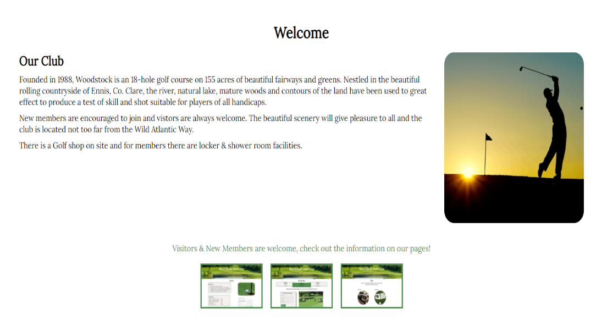
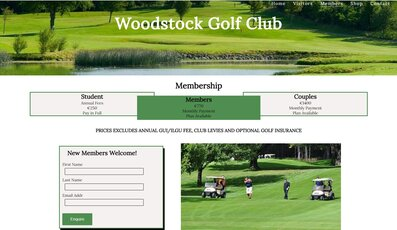

# Woodstock Project
- [Woodstock Project](#woodstock-project)
  * [User Stories](#user-stories)
  * [Design of Website](#design-of-website)
    + [Wireframes](#wireframes)
  * [Features](#features)
    + [Navigation Bar](#navigation-bar)
    + [Homepage](#homepage)
    + [Visitors Page](#visitors-page)
    + [Members Page](#members-page)
    + [Shop](#shop)
    + [Contacts Page](#contacts-page)
    + [Footer](#footer)
  * [Features Left to Implement](#features-left-to-implement)
  * [Technolgies Used](#technolgies-used)
  * [Testing](#testing)
  * [Deployment](#deployment)
  * [Credits](#credits)
  * [Media](#media)

<small><i><a href='http://ecotrust-canada.github.io/markdown-toc/'>Table of contents generated with markdown-toc</a></i></small>

The Woodstock Golf Club website is an information site about a small local golf club. The objective of the site is to showcase the club and its facilities. 
There is a brief description of the club and it’s surroundings. It’s location and the level of skill required to play on the club is also described. It is targeted at existing members, potential new members and visitors to the club.  A navigation bar provides the user with access to more details about green fees, membership fees and dress code. There is also an enquiry form for new members.
Items for sale in the on-site golf shop are displayed with the shop opening hours. There is also a contacts page with contact details.

## User Stories
* Visitors to the club 
  * This user would be anyone interested in finding out more about the Woodstock Golf club, where it is
  located, is it possible to play the course if you are not a member. What is required to play the course,
  dress code and green fee charges. What time is the course open to visitors.
  * This user may be somone just visiting the area on holiday and can play the course for fun.
  * This user may also be part of a group, a society or perhaps a visiting group of golfers from another club or area.
* Existing Member of the club.
  * This user is someone who already is a member of the club. They are interested in the membership fees and how they can be paid.
  * The club member also wants to showcase their club to potential new members and visitors.
  * The club member wants to extend a welcome to make enquiries about their club.
* New Members
  * This website user want to gain information about the club, its facilities and where its located.
  * They want a way of sending an enquiry to get more informtion.
  * This user would also like contact details for the club.
* Shoppers interested in Golf Equipment & Accessories
  * This user is someone who is interested in what is available for purchase at the club shop.
  * This user does not have to be a member but can access information about opening hours and where the club is located.
 
 
## Design of Website
### Wireframes
[Wireframes](https://github.com/Catrionamcd/Woodstock-Project/tree/master/assets/wireframes)

The site is laid out across five screens :
* The Home Page
* Visitors Page
* Members Page
* Shop Page
* Contacts Page

The site is repsonsive acrosss all devices.

## Features

### Navigation Bar

* The navigation bar appears at the top right hand side of all screens.
* It is identical on each page to allow for easy navigation. 
* The page that is active will have the navigation bar element for that page underlined.
* This navigation bar will allow the user to navigate easily from page to page across all devices. 

### Homepage

The home page is a welcome page to all club members, potential new members, visitors and shoppers to 
the club.

Image of the Home Page.

* There is a description of the club and where it is located.
* There is an invite to visitors and new members.
* The facilities for members are mentioned.
* There are clickable mini screens of the visitors, members & shop page which
invites the user to find out more about the club.
* These mini screen zoom out when the user hovers over the image.
* Navigation bar also allows the user to access all pages of the site easily.

### Visitors Page

The visitors page outlines the terms of the club to the user as a visitor to the club.

Image of the Visitors Page.

* An unordered list, lists out clearly the dress code which is required for a visitor to the club.
* A table of the green fees for visitors on different days & times are displayed.
* Fees for societies or groups are displayed.
* A google map and link to the location of the club is displayed for the user to access.
* Navigation bar also allows the user to access all other pages of the site easily.

### Members Page

The members page displays members fees and invites enquiry from new members.

Image of the Members Page.

* There is a breakdown of annual fees for student, single and couples membership.
* There is a form where new members are welcome to make an enquiry.
* Navigation bar also allows the user to access all other pages of the site easily.

### Shop 

The shop page displays golf equipment and accessories that are available at the club.

Image of the Shop Page.

* Images of golf stock sold
* Information on opening hours.
* Navigation bar also allows the user to access all other pages of the site easily.

### Contacts Page

The contacts page displays the contact information of the club.

Image of the Contacts Page.

* The page displays the following contact information :
  * Email Address
  * Phone Number
  * Address of the club
*  Navigation bar also allows the user to access all other pages of the site easily.

### Footer
The footer includes links to the three social media sites which are displayed as icons :
* Facebook
* Twitter
* Instagram

These links will open to a new tab to allow easy navigation for the user.
The footer is valuable to the user as it encourages them to keep up to date with information
about the club via social media.

## Features Left to Implement

A section that describes all 18 holes on the golf course. A video to showcase the whole course.

A section for booking tee times for members of the club.

## Technology

### Languages Used

* HTML5
* CSS3
### Technolgies Used
* Git
* GitHub
* Fontawesome
* Google Fonts
* Google Maps
* Balsamiq
* PicResize
* Paint 3D
* Lighthouse
* Google Chrome Dev Tools

## Testing

The site for all users :
* Tested that the club information is clearly laid out and easy to read.
* Tested for easy navigation throughout the site on all pages. 
* For the visitor, the criteria for using the club as a visitor is clearly explained through list & table.
* Google map displays location of golf club and is clickable to google map app for all users.
* For the members, the different members fees broken down clearly and the club is showcased in an appealing manner
with an invitation for visitors and new members.
* For potential new members, tested the enquiry form for required fields and use of Code Institute formdump code to ensure that the information entered
is posted.
* Tested for responsivness on all devices by using Chrome dev tools.
* Also ran the site on multiple devices to ensure that reponsiveness was working properly.
* Tested that the social networks icons worked when clicked.

HTML
* No errors were found in the code when passing through the W3C Markup Validation Service,
[HTML](https://validator.w3.org/)

CSS
* No errors were found in the code when passing through the official (Jigsaw) validator,
 [CSS](https://jigsaw.w3.org/css-validator/)

## Deployment

The site was deployed to GitHub pages. The steps to deploy the site are :

* Opened GitHub & selected the Woodstock-Project repository from the repositories listed on the left hand side of the screen.

* Within the Woodstock Project repository select the settings button at the top right hand side of the screen.

* In the settings page, scroll down & choose the Github pages. 
* In the Github page select a source of master as a branch name
from the source section drop-down menu.
* Once the branch name is selected click save.

The deployed link will be published at the top of the GitHub page.
The live link can be found here - https://catrionamcd.github.io/Woodstock-Project/Index.html

## Credits

Woodstock Golf club have an old website which the members find hard to navigate. The information is not clearly laid out and some details about the club are hidden in different pages on the site and are hard to find.

I read through the information on the existing Woodstock Golf Club site. I used the information from the site to display the club story and information about the club more clearly, its location and beautiful surrondings.

I also used the exisitng webite to gather information about the dress code and green fees for vistors and a 
breakdown of the fees.

## Media

### Images 

Main banner image is curtesy of Woodstock Golf Club.

All other images are from :

[Pexels](https://www.pexels.com/)

[Pixaby](https://pixaby.com/)

